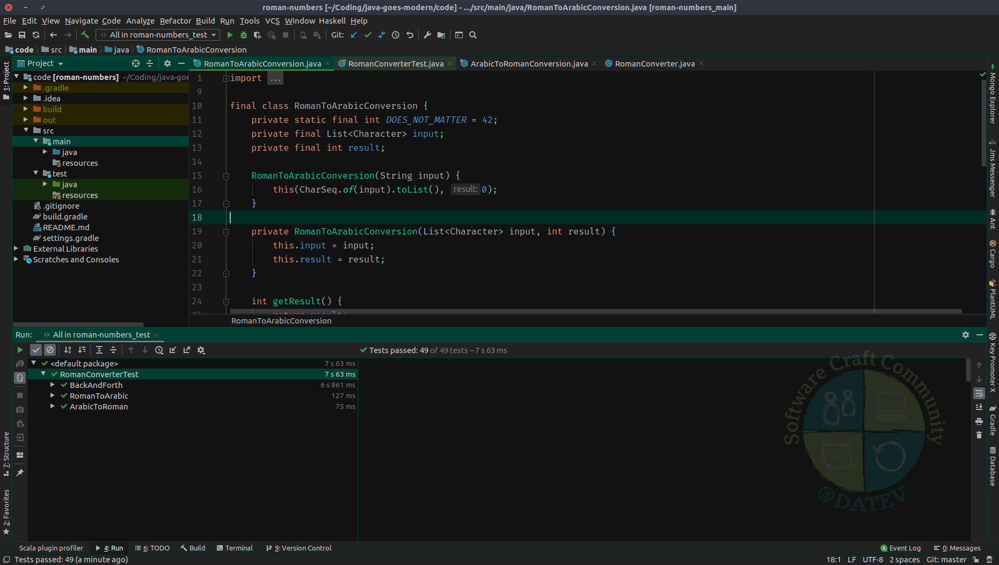

# IntelliJ Theme with DATEV SCC colors

This project includes a complete revamp of the UI colors
of IntelliJ using the color style of the [Internal Software Craftsmanship
Community at DATEV eG](https://twitter.com/SCC_at_DATEV).

[Plugin at JetBrains Repo](https://plugins.jetbrains.com/plugin/12514-datev-scc-ui-theme).



Features:

* UI Theme with custom colors (mostly black and greenish)
* Editor Color Scheme (mostly inspired by the cool [Dark Purple Theme
  from JetBrains](https://plugins.jetbrains.com/plugin/12100-dark-purple-theme))
  
## How to build

```bash
./gradlew buildPlugin
```

## How to work with the project

1. Open the Project in IntelliJ.
2. Navigate to the `theme.json` file and start the preview if you 
   want to fiddle around with my choice of colors.
   See also following [preview issue](https://youtrack.jetbrains.com/issue/IDEA-208996)
   that might produce some problems with the included background
   image.
3. You might also want to have a look at the really helpful 
   [JetBrains Documentation for Custom UI Themes](http://www.jetbrains.org/intellij/sdk/docs/reference_guide/ui_themes/themes_intro.html)

Contributions are always welcome!
